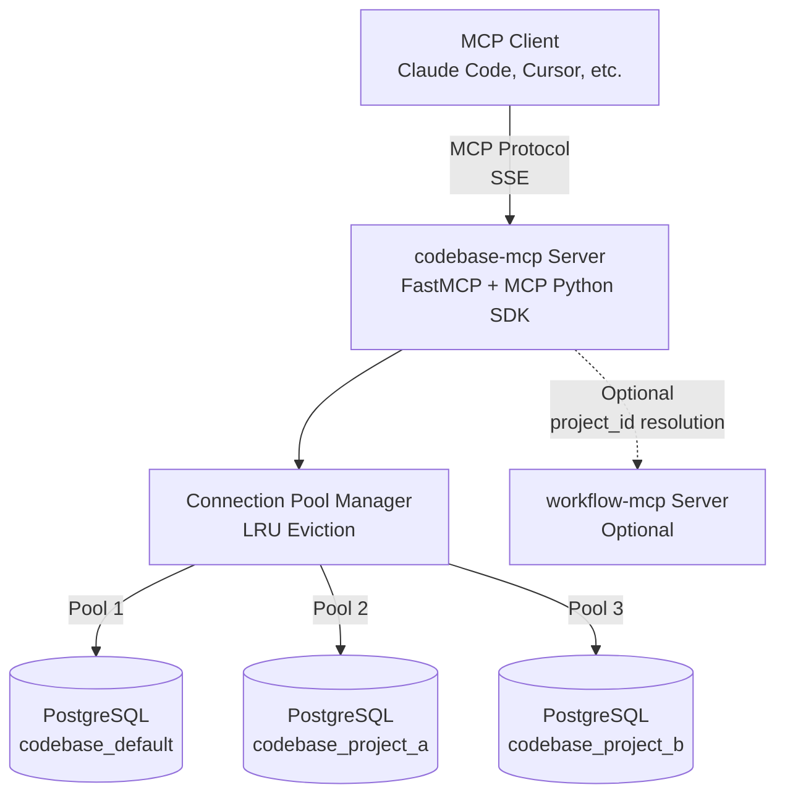
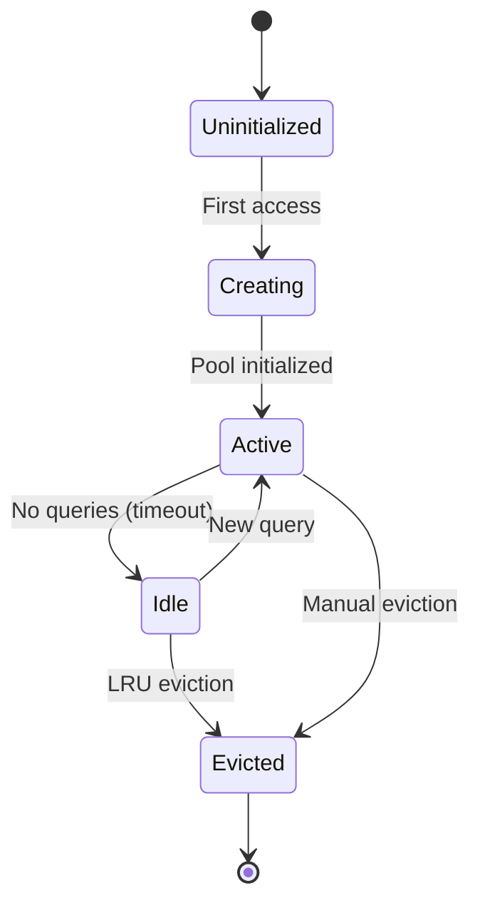
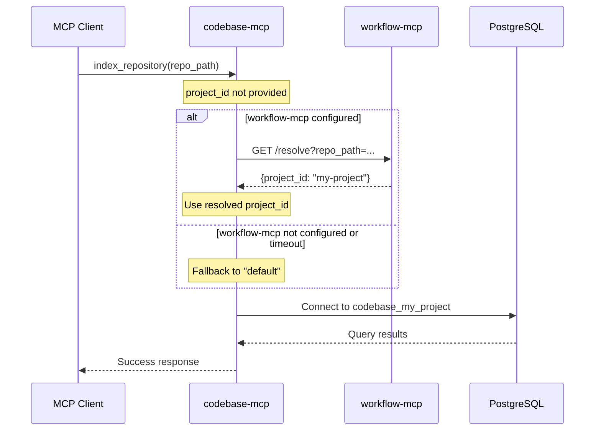

# Multi-Project Architecture Design

The codebase-mcp server is a focused, production-grade MCP server designed specifically for AI coding assistants. It provides semantic code search capabilities by indexing code repositories into PostgreSQL with pgvector embeddings, enabling natural language queries over codebases.

Version 2.0 introduces a fundamental architectural shift to support multi-project workspace isolation. The database-per-project architecture allows multiple independent workspaces to coexist within a single server instance, each with its own isolated PostgreSQL database for complete data separation and tenant isolation. This design maintains the system's core principles of simplicity, local-first operation, and production-grade performance while enabling new multi-tenant use cases.

This document describes the v2.0 architecture for maintainers and contributors who need to understand the connection pool management, database isolation patterns, and integration points with the optional workflow-mcp server for automatic project context resolution.

## Multi-Project Architecture

Version 2.0 fundamentally redesigned the codebase-mcp architecture to support workspace isolation through database-per-project separation. Each project workspace receives its own isolated PostgreSQL database (not just a schema), enabling complete tenant isolation at the database level. The server maintains separate connection pools for each active project database, with LRU (Least Recently Used) eviction to manage resource utilization when the cache reaches capacity.

The architecture optionally integrates with the workflow-mcp server for automatic project context resolution. When both servers are configured, codebase-mcp can automatically resolve the active project ID from workflow-mcp, simplifying multi-project workflows. When workflow-mcp is unavailable or not configured, operations default to the `codebase_default` database, preserving the local-first principle.



### Component Responsibilities

| Component | Responsibility | Implementation |
|-----------|----------------|----------------|
| **MCP Client** | AI coding assistant that consumes MCP tools | Claude Code, Cursor, Windsurf, etc. |
| **codebase-mcp Server** | Semantic code search via MCP protocol | FastMCP framework + MCP Python SDK |
| **Connection Pool Manager** | Database connection lifecycle management | Async SQLAlchemy with LRU eviction |
| **PostgreSQL** | Vector embeddings storage (pgvector) | One database per project workspace |
| **workflow-mcp Server** | Optional project context resolution | External service (optional integration) |

### Data Flow

The typical operation flow follows this path:

1. **Client → Server**: MCP client sends `index_repository` or `search_code` request via SSE transport
2. **Server → workflow-mcp** (optional): If configured, server queries workflow-mcp to resolve the active project ID automatically
3. **Server → Pool Manager**: Server requests database connection for the resolved project ID (or default project)
4. **Pool Manager → PostgreSQL**: Pool manager provides connection from cached pool or creates new pool for project
5. **PostgreSQL → Pool Manager → Server → Client**: Query results flow back through the chain to the MCP client

When `project_id` is explicitly provided in tool parameters, the workflow-mcp resolution is skipped, and operations target the specified database directly. When neither `project_id` nor workflow-mcp context is available, all operations default to the `codebase_default` database, ensuring the system remains fully functional without workflow-mcp integration.

### Key Design Decisions

The v2.0 architecture made several critical design choices:

- **Database-per-project isolation** (not schema-per-project): Provides stronger tenant isolation, enables independent backup/restore per project, and allows per-project PostgreSQL tuning. Schema-per-project was rejected due to security concerns with cross-schema queries and operational complexity.

- **Connection pool per project** (not global pool): Each project database maintains its own connection pool with independent sizing and lifecycle. This design prevents one project from exhausting connections for other projects and enables per-project performance tuning.

- **LRU eviction for pool management**: When the number of active projects exceeds `MAX_PROJECTS` (default: 10), the least recently used project's connection pool is evicted to free resources. This approach balances memory efficiency with performance for frequently accessed projects.

- **Optional workflow-mcp integration** (local-first principle): Integration with workflow-mcp is entirely optional. The codebase-mcp server functions completely standalone without workflow-mcp, defaulting to `codebase_default` for all operations. This preserves the local-first architecture principle while enabling advanced multi-project workflows when desired.

## Database-Per-Project Strategy

### Design Decision

The codebase-mcp v2.0 architecture uses a **database-per-project pattern** (not schema-per-project) where each project workspace receives its own isolated PostgreSQL database. Project identifiers are sanitized and used to generate unique database names following the naming convention:

```
codebase_{sanitized_project_id}
```

The sanitization process transforms project identifiers into valid PostgreSQL database names by applying the following transformations:

1. Convert to lowercase
2. Replace all non-alphanumeric characters with underscores
3. Truncate to maximum 54 characters (PostgreSQL identifier limit minus `codebase_` prefix length)
4. Prepend `codebase_` prefix automatically

### Sanitization Examples

The following table shows how various project identifiers are sanitized into valid database names:

| project_id | Sanitized | Database Name | Notes |
|------------|-----------|---------------|-------|
| default | default | codebase_default | Default workspace |
| my-app | my_app | codebase_my_app | Hyphen → underscore |
| frontend.ui | frontend_ui | codebase_frontend_ui | Dot → underscore |
| Client_A | client_a | codebase_client_a | Uppercase → lowercase |
| 2024-Q1-Project | 2024_q1_project | codebase_2024_q1_project | Multiple transformations |
| user@domain.com | user_domain_com | codebase_user_domain_com | Special chars removed |
| ThisIsAVeryLongProjectNameThatExceedsTheLengthLimit123456789 | thisisaverylongprojectnamethatexceedsthelengthlimit12 | codebase_thisisaverylongprojectnamethatexceedsthelengthlimit12 | Truncated to 54 chars |
| prod-api-v2 | prod_api_v2 | codebase_prod_api_v2 | Multiple hyphens converted |
| client#123 | client_123 | codebase_client_123 | Hash symbol removed |
| Test_Project_123 | test_project_123 | codebase_test_project_123 | Underscores preserved |

### Sanitization Rules

The sanitization algorithm ensures all generated database names are valid PostgreSQL identifiers:

- **Lowercase transformation**: All uppercase letters converted to lowercase (e.g., `Client_A` → `client_a`)
- **Non-alphanumeric replacement**: Characters outside `[a-z0-9]` replaced with underscore (e.g., `@`, `#`, `.`, `-` all become `_`)
- **Maximum length**: Truncated to 54 characters maximum (PostgreSQL identifier limit is 63 bytes; `codebase_` prefix uses 9 bytes)
- **Prefix addition**: `codebase_` automatically prepended to sanitized identifier
- **Result validation**: Final database name matches regex `^codebase_[a-z0-9_]{1,54}$`

### Rationale

The database-per-project pattern was chosen over schema-per-project for the following architectural reasons:

#### Schema Independence

Each project workspace has completely isolated schema with no cross-references between projects. Separate databases provide stronger isolation guarantees than schema-based separation, preventing accidental cross-project queries and ensuring tenant data never leaks across boundaries.

#### Query Performance

Connection routing eliminates cross-database queries entirely. Each project's connection pool connects directly to the project's database, avoiding the overhead of schema qualification in queries and reducing query planning complexity for PostgreSQL.

#### Data Locality

All project data resides in a single database, providing better cache locality. PostgreSQL can optimize buffer pool usage, query plan caching, and index caching per-database rather than managing shared resources across schemas.

#### Backup Granularity

Per-project databases enable granular backup and restore operations without requiring full database dumps. Administrators can backup, restore, or migrate individual projects independently without affecting other workspaces.

#### Multi-Tenancy

Strong isolation for security-sensitive deployments where projects represent different tenants or customers. Database-level separation provides defense-in-depth security, preventing privilege escalation across projects and simplifying audit logging.

#### Resource Limits

Per-database connection pools and query resource limits allow fine-grained resource control. Administrators can set `max_connections`, `work_mem`, and other parameters per-project, preventing resource-intensive projects from affecting others.

### Tradeoffs

The database-per-project strategy has the following tradeoffs:

**Pros**:
- Strong tenant isolation at database level
- Optimized query performance (no schema qualification overhead)
- Granular backup/restore capabilities
- Independent resource limits per project
- Better cache locality for project-specific queries

**Cons**:
- More PostgreSQL databases to manage (one per project)
- Connection pool overhead (separate pool per database)
- Administrative complexity (multiple databases to monitor)
- Higher PostgreSQL resource requirements (each database has overhead)
- No cross-project queries (by design, but limits some use cases)

### Schema Structure

Each project database has identical schema structure optimized for semantic code search. The following simplified SQL shows the key tables and indexes:

```sql
-- Each project database has identical schema
CREATE TABLE repositories (
    id UUID PRIMARY KEY,
    path TEXT NOT NULL,
    indexed_at TIMESTAMP
);

CREATE TABLE code_chunks (
    id UUID PRIMARY KEY,
    repository_id UUID REFERENCES repositories(id),
    file_path TEXT NOT NULL,
    content TEXT NOT NULL,
    start_line INTEGER,
    end_line INTEGER,
    embedding VECTOR(768)  -- pgvector extension
);

CREATE INDEX idx_chunks_embedding ON code_chunks
    USING ivfflat (embedding vector_cosine_ops);
```

The schema is provisioned automatically when a new project is created, ensuring consistency across all project databases.

## Connection Pool Design

### Pool Lifecycle

Each project database connection pool follows a managed lifecycle with automatic initialization, caching, and eviction. The following state diagram shows the pool lifecycle states and transitions:



### State Descriptions

Each state in the pool lifecycle has specific characteristics and transition conditions:

| State | Description | Duration | Transitions |
|-------|-------------|----------|-------------|
| Uninitialized | Pool not yet created | Until first access | → Creating |
| Creating | Async pool initialization | 50-200ms | → Active |
| Active | Pool serving queries | While in use | → Idle, Evicted |
| Idle | Pool inactive but cached | Until timeout | → Active, Evicted |
| Evicted | Pool closed and removed | Permanent | → [*] (end) |

**State Details**:

- **Uninitialized**: Pool entry exists in cache but connection pool not created. No database connections allocated.
- **Creating**: Asynchronous pool initialization in progress. Database connection being established with configured pool parameters.
- **Active**: Pool actively serving queries. One or more connections in use or available in the pool.
- **Idle**: Pool cached but no active connections. All connections idle waiting for timeout. Pool can be reactivated without initialization overhead.
- **Evicted**: Pool closed and removed from cache. All connections closed, resources released. Pool must be recreated if accessed again.

### LRU Eviction Policy

The connection pool manager implements Least Recently Used (LRU) eviction to manage the pool cache size. When the number of cached pools reaches the configured maximum, the least recently accessed pool is evicted to make room for new projects.

**Eviction Timeline Example**:

```
T=0:  Access project_a → Pool created, used_at=0
T=5:  Access project_b → Pool created, used_at=5
T=10: Access project_c → Pool created, used_at=10
T=15: Access project_d → Max pools reached (10)
      → Evict project_a (oldest, used_at=0)
      → Create project_d pool, used_at=15
T=20: Access project_a → Evict project_b (used_at=5)
      → Re-create project_a pool, used_at=20
```

**Key Behaviors**:

- Pool creation takes approximately **50-200ms** on first access (includes database connection establishment and pool initialization)
- Eviction happens automatically when cache reaches `MAX_PROJECTS` limit
- Most recently used pools are always retained (LRU protects active projects)
- Re-accessing an evicted project requires pool re-creation (50-200ms overhead)

**Performance Impact**:

The constitutional guarantee of **<500ms search time** (Performance Guarantees, Principle IV) accounts for pool creation overhead. In the worst case (project not cached), search latency includes:

- Pool creation: 50-200ms
- Embedding generation: ~100-200ms
- Vector search: <100ms
- Total: <500ms (within constitutional guarantee)

### Performance Implications

The connection pool design has the following performance characteristics:

#### Pool Creation Time

First access to a project database requires pool initialization, taking **50-200ms** depending on database latency and connection establishment time. This overhead is included in the constitutional <500ms search time guarantee.

#### Eviction Time

Pool eviction (closing connections and removing from cache) takes **<10ms** and does not block query operations. Eviction happens asynchronously when the cache exceeds capacity.

#### Frequent Eviction Indicators

High pool churn (frequent eviction and re-creation) indicates cache thrashing. Monitor for these symptoms:

- Multiple projects accessed in rotation beyond `MAX_PROJECTS` limit
- Pool creation latency appearing frequently in query traces
- High connection establishment rate in PostgreSQL logs

**Solution**: Increase `MAX_PROJECTS` environment variable to cover 90th percentile of active projects.

#### Optimal Configuration

The `MAX_PROJECTS` setting should cover **90% of active projects** to minimize eviction overhead. Calculate optimal value based on usage patterns:

- **Small deployments**: 10 projects (default)
- **Medium deployments**: 25-50 projects
- **Large deployments**: 100+ projects (requires PostgreSQL tuning)

### Connection Pool Configuration

The following parameters configure connection pool behavior for each project database:

| Parameter | Default | Description |
|-----------|---------|-------------|
| MAX_CONNECTIONS_PER_POOL | 10 | Max connections per project pool |
| MIN_CONNECTIONS | 2 | Minimum idle connections |
| POOL_TIMEOUT | 30s | Connection acquisition timeout |
| IDLE_TIMEOUT | 600s | Connection idle timeout |

**Configuration Notes**:

- **MAX_CONNECTIONS_PER_POOL**: Should accommodate expected concurrent queries per project. Increase for high-concurrency projects.
- **MIN_CONNECTIONS**: Keeps connections warm for faster query execution. Trades memory for reduced latency.
- **POOL_TIMEOUT**: Prevents queries from waiting indefinitely for available connections. Increase if queries frequently timeout.
- **IDLE_TIMEOUT**: Closes idle connections after timeout to reduce resource usage. Decrease for long-running queries.

See the [Environment Variables Reference](../specs/010-v2-documentation/shared-sections/environment-variables.md) for detailed configuration guidance.

### Concurrency Example

The following example shows connection pool behavior with 3 concurrent clients accessing 2 different projects:

```
Client A: index_repository(project_id="proj-a")
Client B: search_code(project_id="proj-a")
Client C: search_code(project_id="proj-b")

Result:
- proj-a pool: 2 active connections (Client A + B)
- proj-b pool: 1 active connection (Client C)
- Total connections: 3
```

**Connection Allocation**:

1. Client A accesses `proj-a` → Pool created with MIN_CONNECTIONS=2 → Connection 1 allocated
2. Client B accesses `proj-a` → Connection 2 allocated from existing pool
3. Client C accesses `proj-b` → New pool created with MIN_CONNECTIONS=2 → Connection 1 allocated

**Resource Usage**:

- Active connections: 3 (1 per client)
- Idle connections: 1 (proj-b has MIN_CONNECTIONS=2, only 1 in use)
- Total connections: 4 (across both pools)

This example demonstrates independent pool management per project with efficient connection reuse.

## workflow-mcp Integration Architecture

The codebase-mcp server supports optional integration with workflow-mcp for automatic project ID resolution. This integration is designed to be non-blocking and respect the local-first architecture principle - codebase-mcp works completely standalone without workflow-mcp, and failures in workflow-mcp communication never block core operations.

When workflow-mcp is configured via the `WORKFLOW_MCP_URL` environment variable, codebase-mcp will attempt to resolve the active project ID automatically. If workflow-mcp is unavailable, times out, or returns an error, codebase-mcp falls back gracefully to the default project workspace (`codebase_default`).



### Integration Behavior

The workflow-mcp integration follows a 5-step resolution process:

**Step 1**: Client calls tool without `project_id` parameter

The MCP client invokes `index_repository()` or `search_code()` without providing the optional `project_id` parameter. This triggers automatic project resolution.

**Step 2**: Server checks `WORKFLOW_MCP_URL` environment variable

The server checks whether the `WORKFLOW_MCP_URL` environment variable is configured. If unset, the server immediately uses the default project.

**Step 3**: Query workflow-mcp with timeout

If configured, the server queries workflow-mcp with a strict 1-second timeout (configurable via `WORKFLOW_MCP_TIMEOUT`):

```http
GET {WORKFLOW_MCP_URL}/resolve?repo_path=/path/to/repo
Accept: application/json
Timeout: 1.0s
```

The timeout is intentionally aggressive to prevent blocking operations. If workflow-mcp does not respond within the timeout window, the request is cancelled and the server falls back to the default project.

**Step 4**: Use returned `project_id` or fallback to default

The server evaluates the workflow-mcp response:
- **Success (200 OK)**: Extract `project_id` from response body and use it for the operation
- **Timeout (>1s)**: Log timeout warning and fall back to `"default"` project
- **Error response (4xx, 5xx)**: Log error and fall back to `"default"` project
- **Network error**: Log error and fall back to `"default"` project

**Step 5**: Route to correct database using resolved `project_id`

The server uses the resolved `project_id` to determine the target PostgreSQL database:

```
project_id="my-project" → database: codebase_my_project
project_id="default"    → database: codebase_default
```

The connection pool manager retrieves or creates a connection pool for the target database, and the operation proceeds normally.

### Fallback Rationale

The fallback to the `"default"` project is critical for maintaining constitutional compliance with the local-first architecture principle. This section explains why graceful degradation is non-negotiable:

**Local-First Principle** (Constitutional Principle II)

Codebase-mcp must operate completely offline after initial setup. The system must function without external dependencies. Workflow-mcp is an optional enhancement, not a requirement. All core indexing and search functionality must remain available even when workflow-mcp is unavailable, misconfigured, or experiencing issues.

**No Blocking**

Workflow-mcp failure must never block core functionality. Users expect semantic code search to work reliably, and communication failures with external services should not prevent operations. The 1-second timeout ensures rapid fallback - users receive immediate responses with the default workspace instead of long waits or error messages.

**Graceful Degradation**

The system degrades gracefully through multiple failure modes:
- Missing `WORKFLOW_MCP_URL` configuration → default workspace (single-project mode)
- workflow-mcp timeout → default workspace (temporary network issues)
- workflow-mcp error response → default workspace (service degradation)

This design ensures codebase-mcp remains functional even when workflow-mcp is completely unavailable.

**Optional Enhancement**

Workflow-mcp adds convenience, not core capabilities. It eliminates manual `project_id` specification for multi-project workflows, but users can always explicitly provide `project_id` as a parameter. The default workspace provides a fully functional single-project experience for users who don't need multi-project isolation.

### Configuration Example

**workflow-mcp integration enabled:**

```bash
# .env file - workflow-mcp integration enabled
WORKFLOW_MCP_URL=http://localhost:8000
WORKFLOW_MCP_TIMEOUT=1.0
WORKFLOW_MCP_CACHE_TTL=60

# All operations use workflow-mcp for project resolution
# Falls back to "default" on timeout/error
```

In this configuration, codebase-mcp will query workflow-mcp for each operation that lacks an explicit `project_id`. Successful resolutions use the returned project ID, while timeouts and errors fall back to the default project.

**Standalone mode (no workflow-mcp):**

```bash
# .env file - standalone mode (no workflow-mcp)
# WORKFLOW_MCP_URL not set

# All operations use "default" project
# Users can manually specify project_id parameter
```

In standalone mode, all operations default to `codebase_default` unless the client explicitly provides a `project_id` parameter. This configuration requires no external services and is ideal for single-project workflows or development environments.

## Component Interactions

This section describes the complete flow of data through the codebase-mcp system for both indexing and search operations, including integration points and performance characteristics.

### Indexing Flow

The repository indexing workflow processes code files from disk into searchable vector embeddings stored in PostgreSQL:

```
[MCP Client]
     |
     | index_repository(repo_path, project_id?)
     v
[codebase-mcp Server]
     |
     |--> [workflow-mcp] (optional project_id resolution)
     |
     v
[Connection Pool Manager]
     |
     |--> Get or create pool for project_id
     |
     v
[PostgreSQL: codebase_{project_id}]
     |
     |--> Scan repository files
     |--> Chunk code files
     |--> Generate embeddings (Ollama)
     |--> Store chunks + embeddings
     |
     v
[Return: repository_id, files_indexed, duration]
```

**Indexing workflow steps:**

1. **MCP Client Request**: Client sends `index_repository(repo_path, project_id?)` via MCP protocol
2. **project_id Resolution**: If `project_id` is omitted, server queries workflow-mcp (if configured) or defaults to `"default"`
3. **Connection Pool Lookup**: Connection pool manager retrieves existing pool or creates new pool for target database
4. **File Scanning**: Server recursively scans repository directory for code files (excludes .git, node_modules, etc.)
5. **Code Chunking**: Files are split into semantic chunks using tree-sitter AST parsing
6. **Embedding Generation**: Chunks are batched (default: 50 per batch) and sent to Ollama for embedding generation
7. **Database Storage**: Chunks and embeddings are inserted into PostgreSQL with pgvector indexing
8. **Response**: Server returns `repository_id`, `files_indexed` count, and total `duration_seconds`

**Performance characteristics:**
- File scanning: I/O bound, parallelized across CPU cores
- Code chunking: CPU bound, tree-sitter AST parsing
- Embedding generation: Network bound (Ollama HTTP API), batched for efficiency
- Database insertion: I/O bound, batched inserts with async commits

### Search Flow

The semantic search workflow generates a query embedding and retrieves similar code chunks using vector similarity:

```
[MCP Client]
     |
     | search_code(query, project_id?, filters...)
     v
[codebase-mcp Server]
     |
     |--> [workflow-mcp] (optional project_id resolution)
     |
     v
[Connection Pool Manager]
     |
     |--> Get pool for project_id
     |
     v
[Ollama]
     |
     |--> Generate query embedding (50-100ms)
     |
     v
[PostgreSQL: codebase_{project_id}]
     |
     |--> Vector similarity search (pgvector)
     |--> Apply filters (file_type, directory)
     |--> Rank results by similarity
     |
     v
[Return: results[], total_count, latency_ms]
```

**Search workflow steps:**

1. **MCP Client Request**: Client sends `search_code(query, project_id?, filters...)` via MCP protocol
2. **project_id Resolution**: If `project_id` is omitted, server queries workflow-mcp (if configured) or defaults to `"default"`
3. **Connection Pool Lookup**: Connection pool manager retrieves existing pool for target database
4. **Query Embedding**: Server sends query text to Ollama to generate 768-dimensional embedding vector (50-100ms)
5. **Vector Search**: PostgreSQL executes pgvector similarity search using cosine distance on embeddings
6. **Filter Application**: Results are filtered by optional `file_type` and `directory` parameters
7. **Result Ranking**: Results are sorted by similarity score (cosine distance, closer to 1.0 is better)
8. **Response**: Server returns matching code chunks with metadata (`file_path`, `start_line`, `end_line`, `similarity_score`)

**Performance characteristics:**
- Query embedding: 50-100ms (Ollama API latency)
- Vector search: 100-200ms (pgvector index scan with cosine distance)
- Filter application: <10ms (indexed file_path column)
- Result serialization: <10ms (JSON encoding)
- **Total latency target**: <500ms p95 (Constitutional Principle IV)

### Performance Targets

The codebase-mcp server guarantees the following performance targets as defined in Constitutional Principle IV (Performance Guarantees):

| Operation | Target | Measurement |
|:----------|:-------|:------------|
| Repository indexing | <60s for 10,000 files | Time from `index_repository` call to completion response |
| Semantic search | <500ms p95 latency | Total time from `search_code` call to response (including embedding generation) |
| Pool creation | 50-200ms | First access to new project database (connection pool initialization) |
| Pool reuse | 0ms overhead | Subsequent accesses to cached project databases |
| Query embedding | 50-100ms | Ollama API call to generate 768-dimensional vector |
| Vector search | 100-200ms | pgvector similarity search with cosine distance |

**Performance monitoring:**

The server provides observability into these performance targets through:
- Structured logs with timing information for each operation stage
- Response metadata including `latency_ms` for search operations and `duration_seconds` for indexing
- Connection pool statistics via health check endpoints (pool size, free connections, overflow usage)

**Performance tuning:**

To optimize performance for your workload:
- Increase `EMBEDDING_BATCH_SIZE` for larger repositories (default: 50, recommended: 50-100)
- Tune `DB_POOL_SIZE` based on concurrent query load (default: 20 connections per project)
- Configure PostgreSQL `shared_buffers` for pgvector index caching (recommended: 25% of system RAM)
- Use SSD storage for PostgreSQL data directory (pgvector indexes benefit from fast random reads)

## Design Rationale

This section documents the key architectural decisions made in v2.0 and the reasoning behind them. Understanding these tradeoffs helps maintainers make consistent decisions when extending the system.

### Why Multi-Project Architecture?

**Problem**: v1.x mixed all data in single database, no isolation

Version 1.x stored all code repositories, embeddings, and metadata in a single PostgreSQL database with no workspace separation. Users working on multiple projects had no way to isolate data, leading to namespace collisions, inability to independently backup/restore projects, and difficulty managing multi-tenant deployments.

**Solution**: Database-per-project with workspace isolation

Version 2.0 introduces a database-per-project architecture where each project workspace receives its own isolated PostgreSQL database. The naming convention `codebase_{project_id}` ensures unique databases per project, with connection pools managed independently for each workspace.

**Benefits**:
- **Multi-tenancy support**: Multiple independent projects in single server instance
- **Data isolation**: Complete separation at database level prevents cross-project queries
- **Per-project backups**: Independent pg_dump/pg_restore operations for each project
- **Resource isolation**: Connection pools and query resources allocated per-project

**Tradeoff**: More PostgreSQL databases vs. better isolation

The database-per-project approach increases PostgreSQL overhead (each database has metadata, buffer cache, WAL logs), but provides much stronger isolation guarantees than schema-based multi-tenancy. This tradeoff prioritizes security and operational independence over resource efficiency.

### Why Database-Per-Project?

**Alternative Considered**: Schema-per-project (shared database)

An alternative design would use multiple PostgreSQL schemas within a single database:

```sql
CREATE SCHEMA project_client_a;
CREATE SCHEMA project_client_b;
CREATE TABLE project_client_a.repositories (...);
CREATE TABLE project_client_b.repositories (...);
```

This approach reduces database overhead but introduces complexity in query scoping and security.

**Chosen**: Database-per-project for stronger isolation

The v2.0 design uses separate databases for each project, providing database-level isolation rather than schema-level isolation.

**Rationale**:
- **No cross-schema queries**: Eliminates risk of accidental cross-project queries (schema-scoped queries require explicit schema qualification in every query)
- **Better cache locality**: PostgreSQL buffer cache is per-database, so each project's working set stays hot independently
- **Resource limits**: Database-level connection limits and memory limits enable per-project resource management
- **Simpler architecture**: No schema-scoped query logic needed - standard SQL queries work without modification

**Tradeoff**: More databases vs. simpler architecture

Database-per-project increases PostgreSQL metadata overhead (each database has `pg_class`, `pg_attribute`, etc.), but dramatically simplifies application code. The code doesn't need to track or inject schema names into queries, reducing complexity and potential for security vulnerabilities.

### Why Connection Pool Manager?

**Problem**: Creating pools on-demand per operation wastes resources

Without connection pool caching, each operation would create a new pool for the target database, then immediately discard it. Pool creation involves establishing connections, negotiating parameters, and warming up the buffer cache - this overhead (50-200ms) would occur on every operation.

**Solution**: LRU-evicted pool cache with MAX_PROJECTS limit

The connection pool manager maintains an LRU cache of active project pools. When an operation needs a database connection, the manager checks the cache first. Cache hits return immediately (0ms overhead), while cache misses create new pools and evict the least recently used project when the cache is full.

**Benefits**:
- **Reuse connections**: Pools stay alive across operations, eliminating repeated creation overhead
- **Limit PostgreSQL load**: `MAX_PROJECTS` cap prevents unbounded connection growth
- **Automatic cleanup**: Evicted pools are gracefully closed, releasing connections and memory

**Tradeoff**: Pool creation latency (50-200ms) on first access

The first operation targeting a new project incurs pool creation latency. This is acceptable because:
- Cache hits (common case) have 0ms overhead
- 50-200ms latency is dwarfed by indexing time (60s for 10,000 files)
- Search latency budget (500ms) accommodates occasional pool creation

### Why Optional workflow-mcp?

**Problem**: Users don't want to manually specify project_id every time

In multi-project workflows, users must explicitly provide `project_id` for every `index_repository` and `search_code` operation. This is tedious and error-prone - forgetting `project_id` causes operations to target the wrong project.

**Solution**: Optional integration for automatic project_id resolution

The workflow-mcp integration allows codebase-mcp to automatically resolve the active project ID based on repository path or current working directory. When both servers are configured, users never need to specify `project_id` manually.

**Benefits**:
- **Convenience**: Automatic project detection for multi-project workflows
- **Context awareness**: Operations automatically target the correct workspace
- **Reduced errors**: No risk of forgetting `project_id` or targeting wrong project

**Principle**: Local-first architecture (Constitutional Principle II)

Integration with workflow-mcp is completely optional and non-blocking:
- **Works standalone**: Codebase-mcp functions fully without workflow-mcp installed
- **Graceful degradation**: Timeout/error falls back to `"default"` project (not error)
- **No blocking**: 1-second timeout prevents long waits for unavailable services
- **Local-only**: workflow-mcp runs locally (http://localhost:8000), no cloud dependencies

**Tradeoff**: Additional service dependency (optional) vs. convenience

Users who want automatic project detection must install and configure workflow-mcp. However, this is entirely optional - codebase-mcp provides full functionality in standalone mode, and users can always manually specify `project_id` parameters.

### Design Philosophy

The multi-project architecture embodies the core constitutional principles:

**Simplicity** (Principle I)

V2.0 focuses on workspace isolation without feature creep. The 16-tool v1.x API (project management, entities, work items, deployments) was reduced to 2 tools (indexing and search), with multi-project support added via the `project_id` parameter. This maintains focus on semantic code search while enabling multi-tenancy.

**Local-First** (Principle II)

No cloud dependencies, offline-capable:
- All data stored in local PostgreSQL databases
- Optional workflow-mcp runs locally (http://localhost:8000)
- System works completely standalone without external services
- Graceful degradation on workflow-mcp failure (fallback to default project)

**Performance** (Principle IV)

Sub-second search, minute-scale indexing:
- <60s indexing for 10,000 files (constitutional guarantee)
- <500ms p95 search latency (constitutional guarantee)
- Connection pool reuse minimizes latency overhead (0ms for cache hits)
- LRU eviction balances memory efficiency with performance for frequently accessed projects

**Production-Grade** (Principle V)

Error handling, logging, monitoring:
- Graceful degradation on workflow-mcp timeout/error (logs warning, continues with default project)
- Comprehensive connection pool health monitoring (pool size, free connections, overflow usage)
- Structured logging for debugging and observability (all operations logged with timing information)
- Clear error messages with context (e.g., "workflow-mcp timeout after 1.0s, falling back to default project")

## References

- [Environment Variables Reference](../specs/010-v2-documentation/shared-sections/environment-variables.md)
- [Glossary: project_id](../glossary.md#project_id)
- [Glossary: connection pool](../glossary.md#connection-pool)
- [Glossary: LRU eviction](../glossary.md#lru-eviction)
- [Glossary: database-per-project](../glossary.md#database-per-project)
- [Glossary: workflow-mcp integration](../glossary.md#workflow-mcp-integration)
- [Glossary: default project](../glossary.md#default-project)
