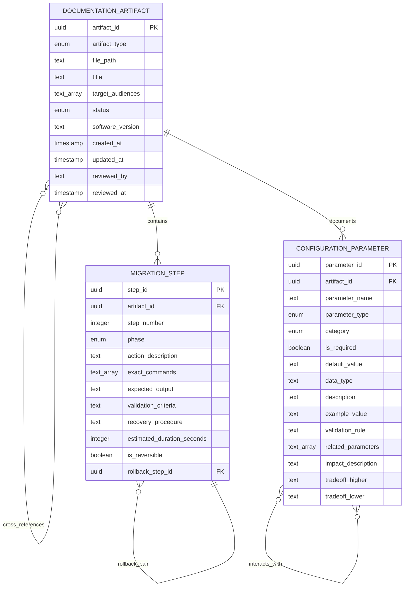

# Data Model: Documentation Artifacts

**Feature**: 010-v2-documentation
**Version**: v2.0
**Date**: 2025-10-13

## Overview

This document defines the entity model for the v2.0 documentation system. These entities represent the structure and content of documentation artifacts, migration procedures, and configuration parameters required for the codebase-mcp v2.0 documentation overhaul.

## Entity: Documentation Artifact

### Description

Represents a specific documentation file (README, migration guide, configuration guide, architecture docs, API reference) with metadata about its purpose, target audience, status, and version alignment with software releases.

### Fields

| Field | Type | Constraints | Description |
|-------|------|-------------|-------------|
| artifact_id | UUID | PRIMARY KEY, NOT NULL | Unique identifier for documentation artifact |
| artifact_type | ENUM | NOT NULL, VALUES: 'README', 'MIGRATION_GUIDE', 'CONFIGURATION_GUIDE', 'ARCHITECTURE_DOCS', 'API_REFERENCE' | Type of documentation artifact |
| file_path | TEXT | NOT NULL, UNIQUE | Relative path within repository (e.g., 'docs/migration/v1-to-v2-migration.md') |
| title | TEXT | NOT NULL, MAX LENGTH: 255 | Human-readable title displayed in documentation |
| target_audiences | TEXT[] | NOT NULL, MIN LENGTH: 1 | Array of audience identifiers (new_user, upgrading_user, administrator, developer, maintainer) |
| status | ENUM | NOT NULL, DEFAULT: 'draft', VALUES: 'draft', 'reviewed', 'approved', 'published' | Current publication status |
| software_version | TEXT | NOT NULL | Software version this documentation targets (e.g., 'v2.0') |
| created_at | TIMESTAMP | NOT NULL, DEFAULT: NOW() | Timestamp when artifact was created |
| updated_at | TIMESTAMP | NOT NULL, DEFAULT: NOW() | Timestamp when artifact was last modified |
| reviewed_by | TEXT | NULL | Username/identifier of reviewer who approved artifact |
| reviewed_at | TIMESTAMP | NULL | Timestamp when artifact was reviewed |

### Relationships

- **Contains**: One Documentation Artifact contains many Migration Steps (1:N)
- **Documents**: One Documentation Artifact documents many Configuration Parameters (1:N)
- **References**: Documentation Artifacts cross-reference each other (N:N via hyperlinks)

### State Transitions

```
[draft] --author completes--> [reviewed] --reviewer approves--> [approved] --publication--> [published]
   ^                                                                                              |
   |                                                                                              |
   +------------------------------update after publication--------------------------------------+
```

**State Descriptions**:
- **draft**: Actively being written, not yet ready for review
- **reviewed**: Author completed, awaiting reviewer approval
- **approved**: Reviewer approved, ready for publication
- **published**: Live documentation users can access

**Transition Rules**:
- `draft → reviewed`: Requires all validation checklists passed (FR-032, FR-033)
- `reviewed → approved`: Requires reviewer sign-off
- `approved → published`: Requires merge to main branch
- `published → draft`: Requires update, triggers re-review cycle

### Validation Rules

**From Functional Requirements**:

- **FR-001**: README artifact MUST have exactly 2 tools documented (index_repository, search_code)
- **FR-002**: README artifact MUST include multi-project support explanation with use case examples
- **FR-003**: README artifact MUST document workflow-mcp integration as optional (standalone usage first)
- **FR-007**: API_REFERENCE artifact MUST mark removed tools as "Removed in v2.0" or exclude them entirely
- **FR-008**: MIGRATION_GUIDE or API_REFERENCE artifact MUST list all 14 removed tools by name
- **FR-032**: All artifacts MUST have 0 broken links (manual verification during authoring)
- **FR-033**: All artifacts MUST have 100% functional code examples (manual testing during authoring)
- **FR-034**: All artifacts MUST use consistent terminology from docs/glossary.md
- **FR-035**: All artifacts MUST follow project markdown style guide

**Validation Enforcement**:
- Link validation: Manual checklist during `draft → reviewed` transition
- Code example validation: Manual testing log during `draft → reviewed` transition
- Terminology validation: Manual review during `reviewed → approved` transition
- Style guide validation: Manual review during `reviewed → approved` transition

---

## Entity: Migration Step

### Description

Represents a discrete action in the v1.x to v2.0 upgrade procedure. Each step includes the action description, exact commands to execute, validation criteria to confirm success, and recovery procedures if the step fails.

### Fields

| Field | Type | Constraints | Description |
|-------|------|-------------|-------------|
| step_id | UUID | PRIMARY KEY, NOT NULL | Unique identifier for migration step |
| artifact_id | UUID | FOREIGN KEY → Documentation Artifact, NOT NULL | Reference to migration guide artifact |
| step_number | INTEGER | NOT NULL, MIN: 1 | Sequential step number in migration procedure |
| phase | ENUM | NOT NULL, VALUES: 'pre_migration', 'backup', 'upgrade', 'validation', 'rollback' | Migration phase this step belongs to |
| action_description | TEXT | NOT NULL, MAX LENGTH: 500 | Human-readable description of action to perform |
| exact_commands | TEXT[] | NULL | Array of exact commands to execute (shell, SQL, Python) |
| expected_output | TEXT | NULL | Description or example of expected command output |
| validation_criteria | TEXT | NOT NULL | How to verify step succeeded (exit code, output match, database state) |
| recovery_procedure | TEXT | NULL | Steps to recover if this step fails |
| estimated_duration_seconds | INTEGER | NULL | Estimated time for step execution (NULL if not yet measured) |
| is_reversible | BOOLEAN | NOT NULL, DEFAULT: true | Whether this step can be rolled back |
| rollback_step_id | UUID | FOREIGN KEY → Migration Step, NULL | Reference to corresponding rollback step (if applicable) |

### Relationships

- **Belongs To**: One Migration Step belongs to one Documentation Artifact (N:1)
- **Sequenced**: Migration Steps form ordered sequence within artifact (step_number ordering)
- **Rollback Pair**: Migration Step may have corresponding rollback step (1:1 optional via rollback_step_id)

### State Transitions

Migration steps themselves don't have state. Their execution status is tracked during actual migration runs (outside this data model). However, steps have a logical execution order:

```
Pre-Migration Checklist → Backup → Upgrade → Validation → (Rollback if needed)
```

**Phase Execution Order**:
1. **pre_migration**: Prerequisite checks (PostgreSQL version, disk space, downtime window)
2. **backup**: Database and configuration backup procedures
3. **upgrade**: Actual migration (stop server, update dependencies, run migration script, update config, restart)
4. **validation**: Post-migration verification (test v2.0 functionality, run diagnostic commands)
5. **rollback**: Recovery procedure (stop server, restore backups, reinstall v1.x, verify restoration)

### Validation Rules

**From Functional Requirements**:

- **FR-009**: Breaking changes must be documented before first migration step
- **FR-010**: Removed tools list (14 tools) must appear before upgrade steps
- **FR-011**: Database schema changes (9 tables dropped, project_id added) documented in breaking changes
- **FR-012**: API changes (project_id parameter) documented in breaking changes
- **FR-013**: New environment variables listed before upgrade steps
- **FR-014**: Upgrade procedure includes steps from backup through validation
- **FR-015**: Backup procedures include exact commands with explanations
- **FR-016**: Rollback procedure covers all upgrade steps (complete restoration)
- **FR-017**: Validation steps confirm v2.0 functionality and v1.x restoration (post-rollback)
- **FR-018**: Migration script execution procedure documented as upgrade step
- **FR-019**: Data preservation policy (repositories preserved, v1.x data discarded) documented
- **FR-036**: Diagnostic commands provided to detect partial migration state
- **FR-037**: Checkpoint resume procedures documented if migration script supports incremental progress

**Step Validation**:
- Each step must have `validation_criteria` (non-null)
- Steps in `upgrade` phase should have corresponding `rollback` phase steps
- `exact_commands` must be tested during documentation authoring (FR-033)
- Commands must produce `expected_output` during testing

---

## Entity: Configuration Parameter

### Description

Represents an environment variable or PostgreSQL setting with its name, default value, description, example values, and relationships to other parameters (e.g., MAX_PROJECTS and MAX_CONNECTIONS_PER_POOL interact in connection calculation).

### Fields

| Field | Type | Constraints | Description |
|-------|------|-------------|-------------|
| parameter_id | UUID | PRIMARY KEY, NOT NULL | Unique identifier for configuration parameter |
| artifact_id | UUID | FOREIGN KEY → Documentation Artifact, NOT NULL | Reference to configuration guide artifact |
| parameter_name | TEXT | NOT NULL, UNIQUE | Environment variable name or PostgreSQL setting name |
| parameter_type | ENUM | NOT NULL, VALUES: 'environment_variable', 'postgresql_setting' | Type of configuration parameter |
| category | ENUM | NOT NULL, VALUES: 'core', 'multi_project', 'workflow_integration', 'monitoring' | Functional grouping |
| is_required | BOOLEAN | NOT NULL, DEFAULT: false | Whether parameter is required or optional |
| default_value | TEXT | NULL | Default value if parameter not set (NULL if required) |
| data_type | TEXT | NOT NULL | Expected data type (string, integer, boolean, URL, etc.) |
| description | TEXT | NOT NULL, MAX LENGTH: 1000 | Human-readable description of parameter purpose |
| example_value | TEXT | NULL | Concrete example value showing correct format |
| validation_rule | TEXT | NULL | Validation constraints (e.g., "Range: 1-50", "Must be valid URL") |
| related_parameters | TEXT[] | NULL | Array of parameter_names that interact with this parameter |
| impact_description | TEXT | NULL | Description of what changing this parameter affects |
| tradeoff_higher | TEXT | NULL | Pros/cons of increasing this parameter value |
| tradeoff_lower | TEXT | NULL | Pros/cons of decreasing this parameter value |

### Relationships

- **Belongs To**: One Configuration Parameter belongs to one Documentation Artifact (N:1)
- **Interacts With**: Configuration Parameters interact with each other (N:N via related_parameters array)
  - Example: `MAX_PROJECTS` interacts with `MAX_CONNECTIONS_PER_POOL` in connection calculation
- **Categories**: Parameters grouped by category (core, multi_project, workflow_integration, monitoring)

### State Transitions

Configuration parameters are static reference data (no state transitions). Their values are applied at system configuration time, not managed by documentation system.

### Validation Rules

**From Functional Requirements**:

- **FR-021**: All environment variables documented with defaults in table format
- **FR-022**: MAX_PROJECTS parameter documented with connection pool implications
- **FR-023**: MAX_CONNECTIONS_PER_POOL documented with tuning guidance and tradeoffs
- **FR-024**: Connection calculation formula documented: `Total = MAX_PROJECTS × MAX_CONNECTIONS_PER_POOL`
- **FR-025**: PostgreSQL tuning parameters recommended for production (e.g., shared_buffers, max_connections)
- **FR-026**: workflow-mcp integration environment variables documented (WORKFLOW_MCP_URL, WORKFLOW_MCP_TIMEOUT)
- **FR-027**: Configuration validation checklist with commands provided
- **FR-038**: Connection pool monitoring metrics and health indicators documented

**Parameter Validation**:
- Each parameter must have `description` (non-null)
- Required parameters (`is_required = true`) must have `default_value = NULL`
- Optional parameters should have `default_value` specified
- Parameters with tradeoffs should have both `tradeoff_higher` and `tradeoff_lower` documented
- `example_value` must be valid according to `validation_rule`
- `related_parameters` array should reference existing parameter_names

**Calculation Formula Parameters**:
- Parameters involved in formulas (MAX_PROJECTS, MAX_CONNECTIONS_PER_POOL) must document `related_parameters`
- Formula-related parameters must have `impact_description` explaining calculation

---

## Entity Relationships Diagram



**Relationship Descriptions**:

1. **Documentation Artifact → Migration Step (1:N)**
   - One migration guide artifact contains many migration steps
   - Steps ordered by `step_number` within artifact
   - Cascade delete: Deleting artifact deletes associated steps

2. **Documentation Artifact → Configuration Parameter (1:N)**
   - One configuration guide artifact documents many parameters
   - Parameters grouped by `category` within artifact
   - Cascade delete: Deleting artifact deletes associated parameters

3. **Documentation Artifact ↔ Documentation Artifact (N:N)**
   - Artifacts cross-reference each other via hyperlinks
   - Example: README links to migration guide, migration guide links to API reference
   - Implemented via Markdown links, not database foreign keys

4. **Migration Step ↔ Migration Step (1:1 Optional)**
   - Upgrade step may have corresponding rollback step
   - Linked via `rollback_step_id` foreign key
   - Example: "Run migration script" (upgrade) ↔ "Restore database backup" (rollback)

5. **Configuration Parameter ↔ Configuration Parameter (N:N)**
   - Parameters interact in calculations or validation
   - Linked via `related_parameters` array (not foreign key)
   - Example: MAX_PROJECTS interacts with MAX_CONNECTIONS_PER_POOL and PostgreSQL max_connections

---

## Usage in Implementation

### Documentation Authoring Workflow

1. **Create Documentation Artifact** (status: draft)
   - Author initializes artifact with metadata (type, file_path, target_audiences, version)
   - Status starts as 'draft'

2. **Author Migration Steps** (for migration guide)
   - Create ordered migration steps (pre_migration, backup, upgrade, validation, rollback phases)
   - Each step includes commands, validation criteria, recovery procedures
   - Create rollback_pair relationships

3. **Author Configuration Parameters** (for configuration guide)
   - Create parameters for environment variables and PostgreSQL settings
   - Document defaults, examples, tradeoffs
   - Specify related_parameters for interacting settings

4. **Validation** (manual procedures)
   - Execute link validation procedure (FR-032)
   - Execute code example testing procedure (FR-033)
   - Execute migration guide validation with v1.x environment
   - Execute configuration guide validation in staging

5. **Review** (status: draft → reviewed → approved)
   - Author marks artifact as 'reviewed' after validation complete
   - Reviewer verifies validation checklists
   - Reviewer approves artifact (status: 'approved')

6. **Publication** (status: approved → published)
   - Merge PR to main branch
   - Update status to 'published'
   - Documentation live for users

### Query Patterns

**Find all draft artifacts requiring review**:
```sql
SELECT artifact_id, artifact_type, file_path, updated_at
FROM documentation_artifact
WHERE status = 'draft'
ORDER BY updated_at DESC;
```

**Get complete migration procedure**:
```sql
SELECT step_number, phase, action_description, exact_commands, validation_criteria
FROM migration_step
WHERE artifact_id = :migration_guide_artifact_id
ORDER BY phase, step_number;
```

**Get configuration parameters by category**:
```sql
SELECT parameter_name, is_required, default_value, description, example_value
FROM configuration_parameter
WHERE category = 'multi_project'
ORDER BY parameter_name;
```

**Find parameters interacting with MAX_PROJECTS**:
```sql
SELECT parameter_name, description, impact_description
FROM configuration_parameter
WHERE 'MAX_PROJECTS' = ANY(related_parameters);
```

---

## Alignment with Functional Requirements

This data model supports the following functional requirement categories:

- **Documentation Accuracy Requirements (FR-001 to FR-008)**: Validation rules enforce tool counts, multi-project documentation, removed tools list
- **Migration Guide Requirements (FR-009 to FR-020, FR-036, FR-037)**: Migration Step entity captures procedure structure with validation and rollback
- **Configuration Guide Requirements (FR-021 to FR-027, FR-038)**: Configuration Parameter entity captures environment variables with defaults, tradeoffs, monitoring
- **Architecture Documentation Requirements (FR-028 to FR-031)**: Documentation Artifact entity tracks architecture docs with maintainer audience
- **Documentation Quality Requirements (FR-032 to FR-035)**: Validation rules enforce link checking, example testing, terminology, style consistency

---

## Notes

**Storage**: This data model is conceptual. In practice, documentation content is stored as Markdown files in version control (Git). This model represents the logical structure and metadata for managing documentation artifacts.

**Version Control**: Git serves as the system of record. Database implementation (if needed) would be read-only mirror for querying/reporting.

**Validation**: Validation rules listed above are enforced manually during authoring via checklists (quickstart.md validation procedures). Automated validation deferred to Phase 07.
